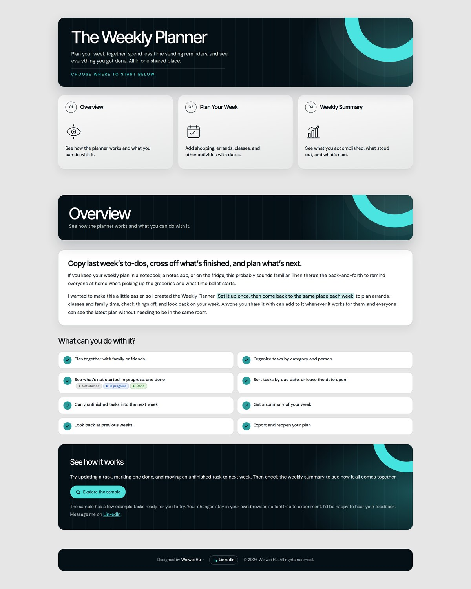
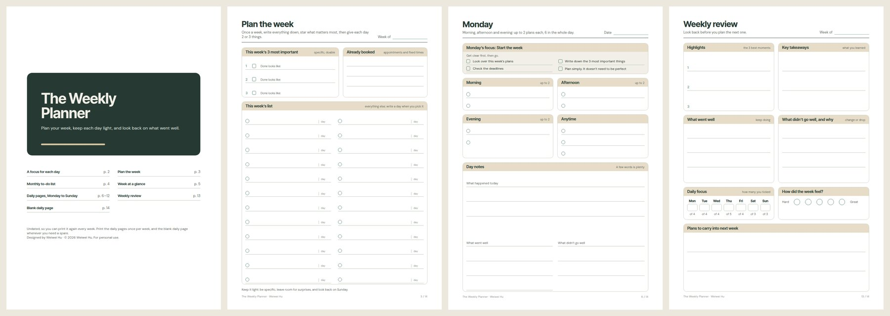

# The Weekly Planner

Plan your week together, spend less time sending reminders, and see everything you got done. All in one shared place.

**See the page:** https://wei-wei-hu.github.io/the-weekly-planner/

## What you can do with it

- Plan together with family or friends
- Organize tasks by category and person
- Plan each day by morning, afternoon and evening
- Give each day a focus, like a midweek check or a tidy-up day
- See what's not started, in progress, and done
- Keep one list for the week and star the 3 that matter most
- Carry unfinished tasks into the next week
- Get a summary of your week
- Look back at previous weeks
- Export and reopen your plan

## Printable and download bundle

Prefer paper? A printable pack is on the way: 14 undated pages in A4 and US Letter, with a focus for each day, a plan-the-week page, a monthly to-do list, a week at a glance, daily pages and a weekly review. A bundle will also include a copy of the planner you can open in your own browser.

The planner itself lives in a private, shared space for the people I plan with. This repository holds its public showcase page. If you'd like to see the planner in action or adapt it for your own week, message me on [LinkedIn](https://www.linkedin.com/in/weiweihu/).

---

Designed by Weiwei Hu · © 2026 Weiwei Hu. All rights reserved.
